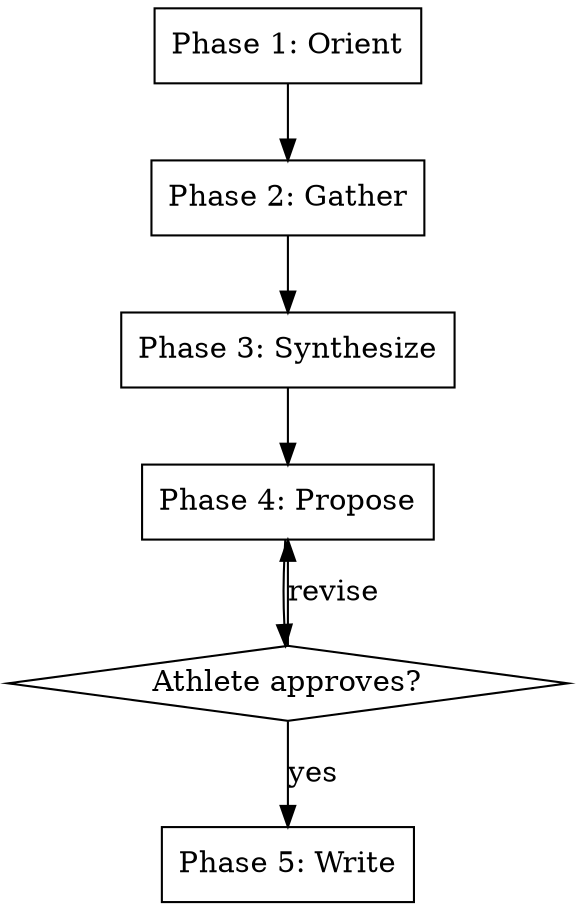

# Adapt Plan

## Overview

Rigid five-phase workflow for post-workout analysis and prescription adaptation. Integrates objective execution data with subjective athlete experience and training block context to make evidence-based adjustments to the next workout prescription. All reasoning is recorded as persistent knowledge in the coaching docs directory.

**This skill is RIGID — phases execute in exact order. Do not skip, reorder, or combine phases.**

## Workflow



---

### Pre-Phase Setup _(no user input — run silently)_

Follow **`${CLAUDE_PLUGIN_ROOT}/shared/setup.md`** — the shared configuration
preamble (paths, config, profile, persona, athlete profile).

**Optional steps this skill declares:** PRESCRIPTIONS, SEASON, MCP, MONITORING

Do not proceed past a stop condition defined there.


### Phase 1 — Orient _(no user input)_

Read and search silently before asking anything:

1. **Active prescription/plan** — List all YAML files in `prescriptions_dir`. For each file, find the maximum session_date. The active block is the file whose most recent session_date is on or before today. If ambiguous (multiple files with recent sessions), ask: "I found multiple prescription files with recent sessions: [list]. Which block are you currently in?" Read the full prescription file for the active block and the surrounding block context (week number, phase, upcoming sessions).

2. **Execution data** — retrieve completed workout from Intervals.icu MCP tools. Note the prescription vs. actual delta: power targets met/missed, duration completed, interval count, HR behavior, any visible fade or drift. Retrieve HRV and wellness data via Intervals.icu MCP tools (get_wellness). If this call fails or returns no data, continue Phase 1 without HRV context and annotate in the Orient summary: "[HRV data unavailable — MCP wellness tool returned no data. Orient proceeds without HRV context.]"

2b. **Stream analysis** — read the active persona's `analyses` config from the loaded persona JSON. If the persona has no `analyses` field, skip this step entirely and proceed to step 3.

   For each analysis entry where `enabled` is `true` (or `enabled` is absent, since default is `true`):
   - Check if the current training phase (determined in step 1) matches the analysis's `phases` array. If `phases` is `null` or absent, the analysis runs in all phases. If the current phase is not in the `phases` array, skip this analysis.
   - Consult `${CLAUDE_PLUGIN_ROOT}/analyses/catalog.md` for the analysis's data source and prerequisites.
   - Check data prerequisites against the completed workout from step 2: does the activity have the required data (power, HR, pace)? Does it meet minimum duration requirements? Is it the right session type (e.g., steady-state for decoupling, intervals for execution quality)?
   - Route the analysis to the correct data source using the table below.
   - Classify the result against the persona's configured thresholds for this analysis.
   - Store the result (metric value, classification, any notable details) for use in Phase 3 — Synthesize.

   **Analysis routing table:**

   | Analysis Key | Stream-dependent? | Data Source |
   |---|---|---|
   | `aerobic_decoupling` | Yes | `stream-analyze --analyses decoupling` |
   | `hr_recovery_curve` | Yes | `stream-analyze --analyses hr_recovery` |
   | `interval_execution_quality` | Partial | Fade/compliance: `get_activity_intervals` MCP; CV: `stream-analyze --analyses interval_cv` |
   | `time_in_zones` | No | `get_power_histogram` + `get_hr_histogram` MCP |
   | `power_curve_trend` | No | `get_power_curves` MCP |
   | `hr_at_power_trend` | No | MCP tools (compact endpoints) |
   | `resting_hr_trend` | No | `get_wellness` MCP |
   | `hrv_trend` | No | `npx tsx ${CLAUDE_PLUGIN_ROOT}/tools/hrv-trend.ts --config {config_path} --date {target_date}` |

   **`hrv_trend` — dedicated CLI tool:** When `hrv_trend` is enabled in the persona:
   1. Run: `npx tsx ${CLAUDE_PLUGIN_ROOT}/tools/hrv-trend.ts --config {config_path} --date {today_YYYY-MM-DD}`. Pass persona-configured windows if present: `--short-window {short_window_days} --long-window {long_window_days} --metric {metric}`.
   2. Parse the JSON output. If `classification.label` is `amber-red` or `red`, surface it prominently in the Orient announcement with the full `reasoning` string.
   3. Store the complete output object as `hrv_trend_result` for use in Phase 3 — Synthesize and Phase 4 — Propose.
   4. If the tool exits non-zero or the output is malformed, annotate: "[hrv_trend unavailable — {error}. Proceeding without.]" and continue.

   **Stream-dependent analyses** — batch all applicable stream-dependent analysis keys into a single CLI call rather than calling separately per analysis:

   1. Read `intervals_icu` config from `{config_path}`. If the `intervals_icu` block is missing or incomplete, skip all stream-dependent analyses and annotate: "[Stream analyses unavailable — intervals_icu config not found in config.json. See SETUP.md.]"
   2. Run the CLI tool:
      ```bash
      npx tsx ${CLAUDE_PLUGIN_ROOT}/tools/stream-analyze.ts \
        --activity-id {activity_id} \
        --analyses {comma_separated_keys} \
        --config {config_path}
      ```
      Where `{comma_separated_keys}` is the union of all stream-dependent analyses enabled for this session (e.g., `decoupling,hr_recovery,interval_cv`).
   3. Parse the JSON output. For each analysis in the result, classify against persona thresholds. If an analysis appears in the `errors` field, skip it and annotate: "[{analysis_key} unavailable — {error_message}. Proceeding without.]"

   **MCP-native analyses** — call the specified MCP tool(s) directly. These endpoints return compact structured data that enters the conversation context efficiently.

   If the activity lacks required data for an analysis (e.g., no power meter, session too short, no identifiable intervals), skip that analysis silently — it is not applicable to this session type.

   After processing all applicable analyses, include a brief summary in the Orient announcement: which analyses ran, which were skipped and why, and any results that immediately stand out (e.g., a red-classified result).

2c. **TSB projection** — after retrieving the completed workout's TSS (from step 2), call the TSB prediction tool:

   ```bash
   npx tsx ${CLAUDE_PLUGIN_ROOT}/tools/tsb-predict.ts --ctl {current_ctl} --atl {current_atl} --tss {tss_sequence}
   ```

   Where `{tss_sequence}` is a comma-separated list of estimated daily TSS values for the upcoming days, derived from:
   - Today's completed session TSS (from step 2, actual value)
   - Upcoming prescribed sessions: estimate TSS from the prescription's power targets and duration. Use the athlete's historical TSS for similar session types as calibration when available.
   - Rest/walk days: use 0 or a small fixed value (30-40) based on typical walk TSS from recent data.

   Include the projection output in the Orient announcement:
   - Predicted next-morning CTL/ATL/TSB
   - Multi-day trajectory through the end of the current week
   - Flag any day where projected TSB crosses a persona threshold (push/moderate/easy/rest)

   If the tool is not installed (npm dependencies missing in tools/), skip this step and annotate: "[TSB projection unavailable — run `npm install` in tools/.]"

3. **Training block context** — determine current phase (base/build/peak/recovery), position within the week, and upcoming workouts that may be affected by today's adaptation. After identifying the active block from step 1, resolve the block name to a template file name by stripping any date prefix and normalizing to lowercase with hyphens (e.g., "Build 1" → "build-1", "Base" → "base", "Race Specificity" → "race-specificity"). Then read `${CLAUDE_PLUGIN_ROOT}/templates/{block-name}.md` as additional context. This file describes the block's intent, session patterns, weekly structure, and success signals. If the file is missing: continue without it and annotate in the Orient summary: "[Block template {block-name}.md not found — proceeding without block template context.]"

4. **Retrieval — find precedent.** Follow `${CLAUDE_PLUGIN_ROOT}/shared/retrieval.md`.
   Build 2-3 queries from *this session's specifics* — the session type, the numbers
   actually observed, and any anomaly worth explaining — never from this skill's name
   or topic. Cover both levels the policy describes: durable pattern, and session
   precedent. Report honestly when nothing relevant is found.

Announce what you found before asking anything. If past decisions are relevant (e.g., "Last time RPE was high on week 2 sub-LT2, we reduced interval count by one"), surface them explicitly.

---

### Phase 2 — Gather _(one question at a time)_

Ask only what execution data cannot answer. Adapt to what the data shows — if a specific pattern is visible (e.g., power fade >10% on final interval), ask specifically about that observation rather than generically.

Core question domains:

1. **Overall RPE** — rate the full session 1–10
2. **Interval progression** — how did intervals feel early vs. late? (effort drift, fade, or build)
3. **Physical sensations** — leg heaviness, HR behavior, breathing quality, any discomfort or unusual response
4. **Recovery context** — sleep quality the night before, life stress, sense of accumulated fatigue going into the session
5. **In-session modifications** — anything deliberately changed in the moment and why

**Ask one question at a time. Wait for each answer before asking the next.**

---

### Phase 3 — Synthesize _(shown to athlete)_

Reason aloud before proposing anything. Cover:

- Prescription vs. execution delta — what happened vs. what was planned
- Stream analysis results — for each analysis that produced a result in step 2b, state: the metric value, its threshold classification (green/amber/red per persona thresholds), and how it interacts with the existing signal picture (TSB/HRV/CTL). Consult the persona's monitoring.md `## Analysis Interpretation` section for the interpretation framework and coaching voice for each analysis. Higher-weight analyses (as configured in the persona's `analyses` config) receive more reasoning space; lower-weight analyses are mentioned briefly. Analyses that **reinforce** the existing signal picture (e.g., decoupling green while TSB is in push zone) are noted concisely. Analyses that **contradict** the existing signal picture (e.g., decoupling red while TSB is in push zone) are called out explicitly with the specific signal interaction from the monitoring.md — these contradictions are the high-value findings that may change the recommendation.
- Subjective data weighted against objective data (e.g., low RPE despite power fade → pacing issue, not fitness gap)
- Training block position — implications differ between early build (accumulate) and peak week (preserve)
- Upcoming workout demands — does the next session's intensity change the calculus?
- Relevant patterns from QMD history — call out if this matches a prior situation
- **HRV trend (when `hrv_trend` fired):** State the statistical position — z_long, percentile, consecutive days below long mean — not just the raw value. Reference the analog lookup: "In N prior instances at or below this value, the median rebound was X days [and prior episodes did/did not show sustained suppression]." This positions the recommendation on the personal distribution rather than an absolute threshold.

This phase is **explanatory only**. No changes proposed yet. The athlete can push back on any part of the reasoning before you proceed.

---

### Phase 4 — Propose _(requires explicit approval)_

Propose specific changes to the next workout. For each change state explicitly:

- **What** changes — interval count, duration, intensity target, rest period, structure
- **Why** — the specific reasoning from Phase 3 that drives this change

Example format:

> "Reduce next sub-LT2 session from 4×12 to 3×12 — RPE 8.5 on the final interval with visible HR drift suggests cumulative fatigue is higher than block average. Week 3 Thursday is a harder session; preserving freshness outweighs hitting volume today."

**When `hrv_trend` fired and `hrv_trend_result` is available:** Express HRV gates in baseline-relative terms. Example:

> **GO** if tomorrow's HRV ≥ `long_mean − 0.5×long_sd` (≈ {computed value} based on today's baseline)
> **MODIFIED** if `long_mean − 1.5×long_sd ≤ HRV < long_mean − 0.5×long_sd`
> **STAND DOWN** if `HRV < long_mean − 1.5×long_sd` OR {consecutive_days_below_long_mean}+ consecutive days below long mean

Compute the numeric approximations from `hrv_trend_result.baselines.long_mean` and `hrv_trend_result.baselines.long_sd`. This recalibrates gates automatically as the baseline drifts.

Wait for **explicit approval, rejection, or modification**. Do not write any files until the athlete approves.

---

### Phase 5 — Write _(with approval)_

Write three artifacts:

**1. Updated prescription file**
Apply approved changes to the relevant prescription YAML in `{prescriptions_dir}/`.

**2. Reasoning record**
Create `{coaching_docs_dir}/{season}/{training-phase}/{week}/YYYY-MM-DD-{workout-name}-adaptation.md` with:

- Workout performed (name, date)
- Prescription vs. actual (key metrics)
- Subjective inputs gathered (RPE, sensations, context)
- What changed and the explicit reasoning
- Any patterns noted for future Orient phases
- Stream analysis results: for each analysis that ran, the metric value, threshold classification, and key interactions noted during Synthesize. Format:
  ```
  ## Stream Analysis
  - [analysis_key]: [value] ([classification]) — [brief detail]

  ## Signal Interactions
  - [how stream analyses combined with TSB/HRV/CTL to inform the recommendation]
  ```
  This section persists analysis results into QMD for longitudinal querying. Future Orient phases can query: "what has aerobic decoupling looked like over the past month?" or "power curve trend across the current block."

Create intermediate directories if they do not exist: `mkdir -p {coaching_docs_dir}/{season}/{training-phase}/{week}/`

**3. QMD index update**

```bash
qmd update
```

**4. Auto-tail monitoring-rollup**

Invoke the `monitoring-rollup` skill in auto-tail mode with `--source=adapt:{block}-{week}-{session}` and the session context already gathered. It captures any DUE active monitoring concerns, appends to their logs, and regenerates their Doctor-Prep summaries. If `concerns.yaml` is absent or has no active/due concerns, monitoring-rollup is a silent no-op — never block on it.

---

## Key Constraints

| Rule                       | Detail                                                                                              |
| -------------------------- | --------------------------------------------------------------------------------------------------- |
| Rigid phases               | Execute in order — no skipping, reordering, or combining                                            |
| Approval gate              | Nothing written until Phase 4 explicitly approved                                                   |
| One question at a time     | Phase 2 never batches questions                                                                     |
| Reasoning before proposing | Phase 3 must complete before Phase 4 begins                                                         |
| Knowledge compounds        | Every adaptation recorded in `{coaching_docs_dir}/{season}/`; future Orient phases benefit from past decisions |
