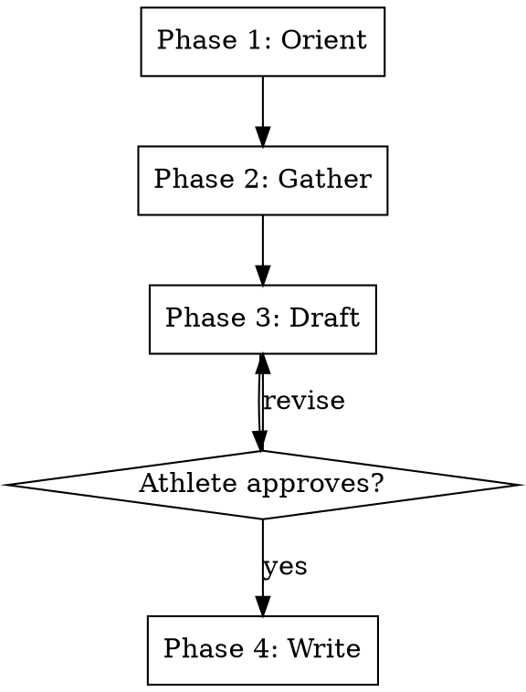

# Block Review

## Overview

Rigid four-phase workflow for end-of-block synthesis. Combines MCP-derived fitness metrics with QMD-retrieved narrative excerpts and athlete reflection to produce a `SUMMARY.md` document — the canonical block-level reference for all future Orient phases. Works at block boundaries and retroactively for past blocks.

**This skill is RIGID — phases execute in exact order. Do not skip, reorder, or combine phases.**

## Workflow



---

### Pre-Phase Setup _(no user input — run silently)_

Follow **`${CLAUDE_PLUGIN_ROOT}/shared/setup.md`** — the shared configuration
preamble (paths, config, profile, persona, athlete profile).

**Optional steps this skill declares:** SEASON, MCP

Do not proceed past a stop condition defined there.


### Phase 1 — Orient _(no user input)_

Pull all data silently, then announce findings before asking anything.

**MCP calls** — all scoped to the block date window:

1. `get_wellness_data(days_back={block_duration_days + 1})` — CTL/ATL/TSB, HRV rMSSD,
   RHR per day across the full block. Scope to dates between `block_start` and `block_end`.

2. `get_recent_activities(days_back={block_duration_days + 1}, limit=50)` — per-session
   TSS, activity name, type, date. Filter to dates within the block window.

3. `get_power_curves(days_back=28)` and `get_power_curves(days_back=90)` — power at
   persona-configured durations for block vs. 90-day baseline comparison.
   If these calls return an API error (known recurring issue), skip and annotate:
   "[Power curve data unavailable — MCP API error. Proceeding without power curve section.]"

**Compute and extract from MCP data:**

- **CTL trajectory:** value at `block_start`, value at `block_end`, peak value and date,
  delta (end minus start), peak ramp rate (largest single-day CTL increase)
- **ATL trajectory:** peak value and date, value at `block_end`
- **TSB trajectory:** lowest point and date, value at `block_end`
- **HRV rMSSD:** block average (mean of all daily readings), first-week average vs.
  last-week average (trend direction), lowest reading and date
- **RHR:** block average, first-week average vs. last-week average (trend direction)
- **Volume by week:** sum TSS per calendar week within the block window
- **Power curve:** % change at persona-configured durations
  (block 28-day best vs. 90-day best; positive = improving, negative = declining)

**QMD queries** — narrative and decision context:

```bash
qmd query "{block_name} key session progression"
qmd query "{block_name} adaptation decisions"
qmd vsearch "{block_name}"

Follow `${CLAUDE_PLUGIN_ROOT}/shared/retrieval.md` when constructing these — parameterize with the specifics below, and add queries for whatever this particular block actually raises.
```

Extract from QMD results:
- Key session metric progressions (power/HR/RPE across W1→W2→W3 for each key
  session type: threshold intervals, over-under intervals, long ride)
- Notable adaptation decisions and their reasoning
- Patterns flagged in "Patterns for Future Orient Phases" sections

**Announce** what was found. Cover:
- Block dates, duration, total TSS
- CTL trajectory summary (start → end, delta, peak ramp rate)
- HRV and RHR trend direction over the block
- Key session progressions surfaced by QMD
- Power curve trend if available
- Any data gaps (missing HRV days, power curve API errors, etc.)
- Any immediately notable findings (e.g., highest ramp rate of the training year,
  HRV suppression pattern, power curve decline despite CTL growth)

---

### Phase 2 — Gather _(one question at a time)_

Ask exactly three questions, in order. Wait for each answer before asking the next.

1. **Block surprise:** "Looking at the block as a whole — what surprised you most,
   positively or negatively?"

2. **Forward confidence:** "What's your confidence going into [next block name]?
   What feels strongest, and what feels like the biggest unknown?"

3. **Off-record context:** "Is there anything that happened during this block —
   training or life — that the adaptation records might not fully capture?"

---

### Phase 3 — Draft _(shown to athlete)_

Present the complete `SUMMARY.md` content as a draft. The athlete can request
changes before anything is written. Iterate until explicitly approved.

**Document structure:**

```markdown
# {Block Display Name} — Block Summary
**Dates:** {block_start} → {block_end}
**Persona:** {active_persona display name}
**Block goal:** {one sentence from template, or inferred from block name if template missing}

## Fitness Metrics
| Metric | Block Start | Block End | Change |
|--------|------------|-----------|--------|
| CTL | | | |
| ATL (peak) | {date} | | |
| TSB (low point) | {date} | | |
| HRV rMSSD (block avg) | — | — | {first week avg} → {last week avg} |
| RHR (block avg) | — | — | {first week avg} → {last week avg} |
| Peak ramp rate | — | — | {value} TSS/day |

## Volume
| Week | Actual TSS | Key sessions completed |
|------|-----------|----------------------|
| W1 | | |
| W2 | | |
| W3 | | |
| Total | | |

## Key Session Progressions
{One table per key session type present in the block}

Example for threshold intervals:
| | W1 | W2 | W3 |
|---|---|---|---|
| Structure | 3×10min | 3×12min | 4×12min |
| Avg power | | | |
| Avg HR | | | |
| RPE | | | |
| Notes | | | |

## Power Curve
{Skip section if data unavailable — annotate why}
| Duration | Block best | vs. 90-day best | Trend |
|----------|-----------|-----------------|-------|
| 20min (1200s) | | | |
| 60min (3600s) | | | |

## Block Assessment
Narrative: how block goals (from template) compare to actual outcomes.
What the data says worked. What the data says didn't. How the block's
execution compared to the template's "signals this block should produce."
Reference the active persona's stated decision signals — the volume policy
prioritizes CTL trajectory, while the conservative policy weights freshness and HRV more heavily.

## Athlete Perspective
Narrative from Phase 2 Gather — surprises (positive and negative),
qualitative feel of the block, what the athlete would do differently.
Written in the athlete's voice, not paraphrased into coaching language.

## Calibration Points for Future Blocks
Bullet list of concrete, queryable facts discovered during the block:
- Session ceilings (e.g., "surge ceiling: 2 full + partial third at 5+ hours")
- Recovery patterns (e.g., "big Saturday → 72hr to rebound to HRV 40+")
- Fueling discoveries
- Equipment notes
- External stress interaction patterns
- Anything flagged in individual adaptation records under "Patterns for Future Orient Phases"

## Entering {Next Block Name}
Confidence level (from Gather). Specific watchpoints for the first week
of the next block based on how this one ended — what to monitor, what
the first key session should confirm, and what would trigger a reassessment.
```

---

### Phase 4 — Write _(with approval)_

Write two artifacts:

**1. Block summary document**

Write `{coaching_docs_dir}/{season}/{block}/SUMMARY.md` with the approved content.
Create the directory if it does not exist:
```bash
mkdir -p {coaching_docs_dir}/{season}/{block}/
```

**2. Auto-tail lessons-rollup**

Invoke the `lessons-rollup` skill with:
- `--source=block-review:{normalized-block-name}`
- The bullets from the `## Calibration Points for Future Blocks` section of the just-written SUMMARY.md as the append list.

If the rollup's diff is purely additive, it auto-writes silently. If it would retire or rewrite an existing profile entry, it shows the diff and gates on athlete approval before writing.


**3. QMD index update**

```bash
qmd update && qmd embed
```

---

## Key Constraints

| Rule | Detail |
|------|--------|
| Rigid phases | Execute in order — no skipping, reordering, or combining |
| Approval gate | Nothing written until Phase 3 draft explicitly approved |
| One question at a time | Phase 2 never batches questions |
| No full file reads | MCP for metrics, QMD for narrative — no prescription YAML reads beyond frontmatter, no full adaptation record reads |
| Retroactive-safe | Works on past blocks; block date window comes from prescription YAML frontmatter, not "today" |
| Data gaps are acceptable | Missing power curves, HRV gaps, or QMD misses are annotated and the skill continues — a partial summary is better than no summary |
