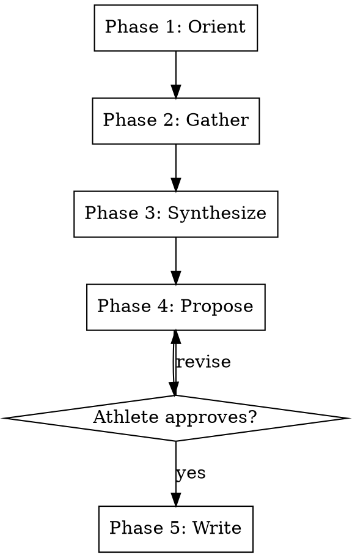

# Consult

## Overview

Workflow for analysis of objective historical execution data, subjective athlete experience, existing workout prescriptions, and occurances in life outside of athletic endeavors. Provides evidence-based adjustments to the plan, and advice on balancing with life requirements. All reasoning is recorded as persistent knowledge in the coaching docs directory.

**This skill is RIGID — phases execute in exact order. Do not skip, reorder, or combine phases.**

## Workflow

---

### Pre-Phase Setup _(no user input — run silently)_

Follow **`${CLAUDE_PLUGIN_ROOT}/shared/setup.md`** — the shared configuration
preamble (paths, config, profile, persona, athlete profile).

**Optional steps this skill declares:** PRESCRIPTIONS, SEASON, MCP, MONITORING

Do not proceed past a stop condition defined there.

### Phase 1 — Orient _(no user input)_

Read and search silently before asking anything:

1. **Weekly consultation** - Read `{coaching_docs_dir}/{season}/{training-phase}/consultations.md` to gain context on recent concerns athlete has raised with coach over this training phase.
2. **Historical adaptations** - Read `{coaching_docs_dir}/{season}/{training-phase}/{week}/.*-adaptation.md` records to understand historical adaptations and patterns tied to specific workouts.
3. **Active prescription/plan** — List all YAML files in `prescriptions_dir`. For each file, find the maximum session_date. The active block is the file whose most recent session_date is on or before today. If ambiguous (multiple files with recent sessions), ask: "I found multiple prescription files with recent sessions: [list]. Which block are you currently in?" Read the full prescription file for the active block and the surrounding block context (week number, phase, upcoming sessions).
4. **Training block context** — determine current phase (base/build/peak/recovery), position within the week, and upcoming workouts that may be affected by today's adaptation. After identifying the active block from step 1, resolve the block name to a template file name by stripping any date prefix and normalizing to lowercase with hyphens (e.g., "Build 1" → "build-1", "Base" → "base", "Race Specificity" → "race-specificity"). Then read `${CLAUDE_PLUGIN_ROOT}/templates/{block-name}.md` as additional context. This file describes the block's intent, session patterns, weekly structure, and success signals. If the file is missing: continue without it and annotate in the Orient summary: "[Block template {block-name}.md not found — proceeding without block template context.]"

5. **Retrieval — find precedent.** Follow `${CLAUDE_PLUGIN_ROOT}/shared/retrieval.md`.
   Build 2-3 queries from *this session's specifics* — the session type, the numbers
   actually observed, and any anomaly worth explaining — never from this skill's name
   or topic. Cover both levels the policy describes: durable pattern, and session
   precedent. Report honestly when nothing relevant is found.

Announce what you found before asking anything. If past decisions are relevant (e.g., "Last time RPE was high on week 2 sub-LT2, we reduced interval count by one"), surface them explicitly.

### Phase 2 Gather _(one question at a time)_

Ask only what execution data cannot answer. Adapt to what the data shows — if a specific pattern is visible (e.g., power fade >10% on final interval), ask specifically about that observation rather than generically.

1. Do you have concerns about the plan? Has something come up that I should know about?

If the answer to the first question doesn't provide enough context to work with, ask a few more questions to prompt athlete, for example:
1. Are you sick?
2. Are you more or less tired than expected?
3. Is work overly stressful?

**Ask one question at a time. Wait for each answer before asking the next.**

### Phase 3 — Synthesize _(shown to athlete)_

Reason aloud before proposing anything. Cover:

- Sickness
- Expected tireness, how that tracks to where athlete is in the phase/plan, threshold classification (green/amber/red per persona thresholds), and how it interacts with the existing signal picture (TSB/HRV/CTL). 
- Consult the persona's monitoring.md `## Analysis Interpretation` section for the interpretation framework and coaching voice for each analysis. Higher-weight analyses (as configured in the persona's `analyses` config) receive more reasoning space; lower-weight analyses are mentioned briefly. Analyses that **reinforce** the existing signal picture (e.g., decoupling green while TSB is in push zone) are noted concisely. Analyses that **contradict** the existing signal picture (e.g., decoupling red while TSB is in push zone) are called out explicitly with the specific signal interaction from the monitoring.md — these contradictions are the high-value findings that may change the recommendation.
- Subjective data weighted against objective data (e.g., low RPE despite power fade → pacing issue, not fitness gap)
- Training block position — implications differ between early build (accumulate) and peak week (preserve)
- Upcoming workout demands — does the next session's intensity change the calculus?
- Emphasis relevant patterns from QMD history. Call out if this matches prior lessons/patterns/successes/mistakes.
- Reference ATHLETE_PROFILE.md when patterns from prior blocks are relevant to the consultation question. Cite the source tag in your reasoning so the athlete can trace the basis (e.g., "based on the recovery pattern from `[block-review:build-1-2026]`").

Alongside the reasoning above, assemble the typed domain input for this consultation as a `StructuredChangeSet`. If Phase 3 reasoning concludes the prescription should change, emit **one state change** containing:

- `entity_type: "prescription"` with `key_components` carrying `arc_id` and the durable `session_id`
- the effective date of the change
- a concise statement of what changes and why
- the COMPLETE updated prescription session value — never a prose patch. The value must carry every field of the session: `sessionId`, `sessionDate`, `sessionName`, block metadata (`blockName`, `week`, `day`), `order`, `effortZone`, and the full `intervals` array (each with `durationMin`, `powerLowPct`, `powerHighPct`, `count`, `recoveryMin`)
- the artifact relative path (e.g. `prescriptions/{arc_id}.yaml`)

Also emit **one consultation event** containing:

- the athlete's question or concern
- the subjective inputs gathered (sickness, fatigue, life stress)
- the decision rationale linking Phase 3 evidence to the action
- `action_targets`: the session IDs the decision acts on
- the compatibility path of the consultation log (e.g. `coaching/consultations.md`)

If no prescription change is warranted, the change set carries only the consultation event.

**Monitoring contributions (merged BEFORE Phase 4)**

Before Phase 4 begins, collect due monitoring contributions so ONE preview
covers everything:

1. Invoke the `monitoring-rollup` skill in **CONTRIBUTION MODE** with
   `source = consult:{YYYY-MM-DD}` and the context already gathered this
   session. It reads `{coaching_docs_dir}/tracking/concerns.yaml`, gathers
   any DUE active concern, and RETURNS typed `state_changes` (keyed
   `monitoring:<concern-id>:<signal>` current state) and append-only
   `events` — it never previews, never applies, and never writes.
2. Merge both arrays into THIS change set. The merged change set is what
   Phase 4 previews: one plan hash and one approval cover the prescription
   change, the consultation event, and all due monitoring changes together.
3. If no concern is active or due, monitoring-rollup returns EMPTY arrays.
   Merge them and continue — the parent's single preview stands; never
   produce a second preview for monitoring.

This phase is **explanatory only**. No changes proposed yet. The athlete can push back on any part of the reasoning before you proceed.

### Phase 4 — Propose/Answer _(requires explicit approval)_

Answer athlete's questions. Do not coddle the athlete. Propose specific changes to the plan, and **be realistic** about what matches the training goals. If there are multiple approaches, seek athlete's input for what fits their needs and be explicit about what the tradeoffs are, both within the training plan and inside the broader needs of their life.

For each change, explicitly state:
- **What** changes — interval count, duration, intensity target, rest period, structure
- **Why** — the specific reasoning from Phase 3 that drives this change
- **Tradeoffs** - what will have to change (whether other parts of plan, or outside scope of athletic endoavors, or anything else) to support this change.

**Before presenting anything**, call `engram_capture_preview` with the Phase 3 merged `StructuredChangeSet` — the single preview covers the prescription change, the consultation event, and any due monitoring contributions as one plan.

If the preview returns blocked, STOP: Phase 4 cannot proceed until the input is corrected and a preview succeeds.

Present TOGETHER, in one message:

1. The human coaching proposal. Answer athlete's questions; do not coddle the athlete. Propose specific changes to the plan, and **be realistic** about what matches the training goals. For each change state:
   - **What** changes — interval count, duration, intensity target, rest period, structure
   - **Why** — the specific reasoning from Phase 3 that drives this change
   - **Tradeoffs** - what will have to change (whether other parts of plan, or outside scope of athletic endoavors, or anything else) to support this change.
2. The record plan from the preview: which records will be created, refined, superseded, or retired.
3. The generated compatibility artifact paths that will regenerate (e.g. `prescriptions/{arc_id}.yaml`, `coaching/consultations.md`).
4. The exact `plan_hash` from the preview result.

Ask for approval. Approval must explicitly cover BOTH the coaching action AND the record/artifact plan identified by that exact `plan_hash` — approving the advice approves the durable mutation of the same content.

Wait for **explicit approval, rejection, or modification**. On modification, rebuild the change set, re-run `engram_capture_preview`, and present the new hash.

### Phase 5 — Apply _(with approved hash)_

Call `engram_capture_apply` with ONLY the exact `plan_hash` the athlete approved. Never edit any file directly — every prescription YAML, the consultation log, and the qmd index are updated by the apply pipeline (records → guarded index refresh → regenerated compatibility views).

Outcome handling:

- **stale**: the records changed since preview. Return to Phase 4: re-run `engram_capture_preview`, present the fresh record plan and new `plan_hash`, and obtain fresh athlete approval before applying again.
- **apply failure**: stop Phase 5. No compatibility view is written and none may be edited by hand; diagnose and retry through the tools.
- **committed with a stale index or stale views**: the records ARE authoritative — report the authoritative record IDs to the athlete and the exact retry state: re-calling `engram_capture_apply` with the SAME committed `plan_hash` in the same session reruns only materialization and never re-approves or re-applies the record mutations.
- **committed clean**: report the applied record IDs.

---

## Key Constraints

| Rule                       | Detail                                                                                              |
| -------------------------- | --------------------------------------------------------------------------------------------------- |
| Rigid phases               | Execute in order — no skipping, reordering, or combining                                            |
| Approval gate              | Nothing written until Phase 4 explicitly approved                                                   |
| One question at a time     | Phase 2 never batches questions                                                                     |
| Reasoning before proposing | Phase 3 must complete before Phase 4 begins                                                         |
| Knowledge compounds        | Every adaptation recorded in `{coaching_docs_dir}/{season}/`; future Orient phases benefit from past decisions |
