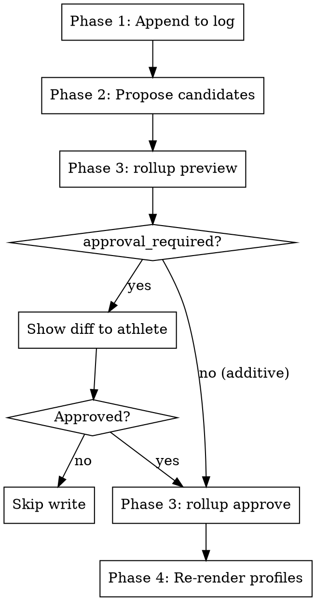

# Lessons Rollup

## Overview

Rigid four-phase workflow for maintaining the athlete-lifetime learning record. Appends new calibration points to an append-only log, proposes claim records for the changes, and re-renders the `ATHLETE_PROFILE.md` and `COACH_PROFILE.md` working summaries that `adapt-plan`, `consult`, `block-review`, and `season-retrospective` read as reasoning context. Diffing, the approval gate, sequential application, and the qmd refresh/embedding pass belong to the harness; this skill supplies coaching judgment and nothing else.

**This skill is RIGID — phases execute in exact order. Do not skip, reorder, or combine phases.**

## Workflow



---

## Invocation Modes

This skill is called in two modes:

**Auto-tail (called by other skills):** Caller passes `--source={tag}` (e.g., `block-review:example-build`, `race:example-endurance-event`, `season:2027-example-season`) and an optional explicit list of bullets to append. Non-additive diffs still gate on approval.

**Standalone (manual):** No `--source` flag. Skips Phase 1 (no append), runs Phase 2 only — re-curates the profile from the existing log. Use after manually editing `lessons-log.md` or after a persona change.

---

### Pre-Phase Setup _(no user input — run silently)_

Follow **`${CLAUDE_PLUGIN_ROOT}/shared/setup.md`** — the shared configuration
preamble (paths, config, profile, persona, athlete profile).

**Optional steps this skill declares:** none — config, persona, and athlete profile only

Do not proceed past a stop condition defined there.


### Phase 1 — Append to log _(skipped in standalone mode)_

For each new bullet provided by the caller, append a new entry to `lessons-log.md` in this format:

```markdown
## {YYYY-MM-DD} — {source-tag}
- {bullet 1}
- {bullet 2}
- {bullet 3}
```

Use today's date. Source tag is the exact value passed in (e.g., `race:gravel-classic-2026`).

The append is literal — never rewrite or merge with prior entries. Multiple invocations on the same day under the same source tag append multiple sections (the curation step in Phase 2 dedupes the working profile).

Announce: "Appended {N} bullets to lessons-log.md under {source-tag}."

---

### Phase 2 — Propose claim candidates

Read the entire `lessons-log.md`. The profile is no longer hand-written: it is a
**rendered artifact** produced from claim records under `{coaching_docs_dir}/claims/`.
This phase produces *candidates*; the harness owns diffing, approval, and writing.

Reason across all log entries to decide what should change:

1. **Group by theme:** the space's configured theme vocabulary, read from
   `{coaching_docs_dir}/pack-config.json`. Adding a theme is a configuration change,
   not a prose change.

2. **Dedupe with source merging:** when 2+ entries express the same pattern, propose one
   claim carrying every source tag. A `supersede` candidate inherits the retired claim's
   sources automatically — never restate them by hand.

3. **Supersede contradicted entries:** when a newer entry contradicts an older one,
   propose `disposition: "supersede"` naming the predecessor. The harness retires the
   predecessor and keeps its trace; there is no `## Retired` section to maintain.

4. **Persona-fit is special:** the bridge between data and persona-change decisions.
   Write each as: pattern observed → does it match the active persona's expectations →
   recommendation.

Emit one batch file of candidate envelopes:

```json
{ "schema_version": 0, "candidates": [ { "id": "...", "kind": "claim", "disposition": "new" } ] }
```

---

### Phase 3 — Review and approve through the harness

The diff gate, the additive/non-additive classification, and the approval binding are the
harness's, not this skill's. Preview the batch:

```bash
engram rollup preview --bullets {batch}.json
```

Show the athlete the rendered diff. `approval_required: true` means the batch is
non-additive and needs an explicit yes. On approval, re-supply the same batch file with
the previewed hash:

```bash
engram rollup approve --bullets {batch}.json --expect {rollup_hash}
```

Approval is stateless and bound to the plan: if any record changed since the preview, the
approval is refused as `stale_approval` and nothing is written. A batch is fail-stop, not
atomic — earlier commits stand, and the response names the stopping candidate and every
untried one. Re-preview before retrying.

Never run `qmd update` or `qmd embed` here. The harness refreshes the bound collection and
runs exactly one embedding pass after any durable write, scoped to this space. A bare qmd
command indexes every collection on the machine and is prohibited.

---

### Phase 4 — Re-render the profiles

Both profiles are generated from the same claim records; neither is edited by hand.

```bash
engram render --view athlete-profile --audience athlete \
  --delivery profile-markdown --model orchestrator/manual
engram render --view athlete-profile --audience coach \
  --delivery profile-markdown --model orchestrator/manual
```

Write the athlete render to `{coaching_docs_dir}/ATHLETE_PROFILE.md` and the coach render
to `{coaching_docs_dir}/COACH_PROFILE.md`.

There is no privacy, visibility, or persona-fit split between these renders. The
presentation pack authorizes `athlete`, `coach`, and `self-coach` identically — every
active, retrieval-eligible engram-coach record, unfiltered — and projects the same facts,
uncertainty, actions, and recommendation IDs into all three. `ATHLETE_PROFILE.md` and
`COACH_PROFILE.md` are the same content under a different title. `self-coach` is that same
audience again, for an athlete acting as their own coach; this skill does not keep it as a
standing file, but it renders on demand identically to the other two:

```bash
engram render --view athlete-profile --audience self-coach \
  --delivery profile-markdown --model orchestrator/manual
```

A fourth audience, `clinician`, is the only one that actually filters: monitoring
captures, lactate tests, and any record (workout adaptations included) carrying a
health-relevant training signal (HRV, resting HR, lactate threshold, sleep, stress,
illness, injury). It is rendered on demand rather than kept as a standing file, because a
doctor-prep summary is episodic:

```bash
engram render --view athlete-profile --audience clinician \
  --delivery profile-markdown --model orchestrator/manual
```

The clinician render carries the same facts/uncertainty/actions shape as the other three,
narrowed to that health-relevant record set. There is no configurable clinical-theme list
and no persona-fit content in any render — the projection never derives persona-fit at
all.

---

## Key Constraints

| Rule | Detail |
|------|--------|
| Append-only log | `lessons-log.md` is never rewritten or pruned by this skill |
| Source tagging | Every log entry carries `source-tag`; the harness renders a claim's merged sources into the profile, so tags are never typed by hand |
| Non-additive gate | Enforced by `rollup preview`/`approve`, not by this skill; approval is bound to the previewed plan and refused as `stale_approval` if anything moved |
| Standalone is read-only on log | Standalone mode skips Phase 1 — no append, only re-curation |
| Profiles are generated | `ATHLETE_PROFILE.md` and `COACH_PROFILE.md` are rendered artifacts; hand edits are overwritten by the next render. Change a claim record, not the file |
| Profiles are identical | `ATHLETE_PROFILE.md` and `COACH_PROFILE.md` carry the same record-derived content — the `athlete`, `coach`, and `self-coach` audiences authorize identically, so there is no private-vs-full split to reconcile |
| qmd is the harness's | Never run `qmd update`/`qmd embed`; a bare invocation indexes every collection on the machine |
