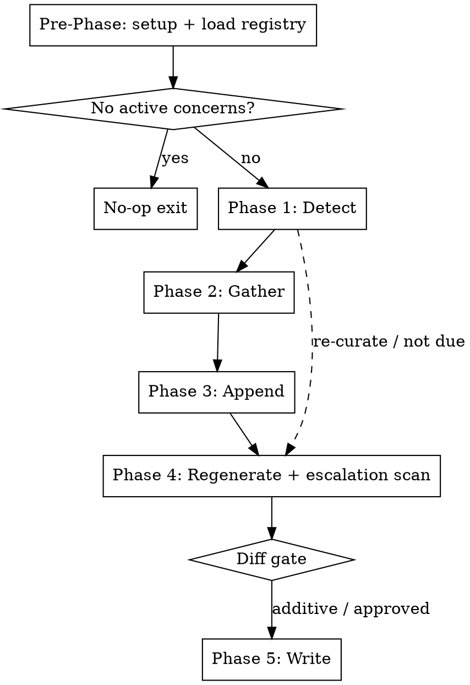

# Monitoring Rollup

## Overview

Rigid phased workflow for longitudinal tracking of declared **monitoring concerns** — chronic symptoms/issues tracked over time so an eventual clinician visit is well-armed with data. Captures structured entries into each concern's append-only log, then regenerates that concern's curated Doctor-Prep Summary and scans for escalation triggers.

**Generic:** all athlete-specific declarations live in `{coaching_docs_dir}/tracking/concerns.yaml`. This skill contains no concern-specific knowledge.

**This skill is RIGID — phases execute in exact order. Do not skip, reorder, or combine phases.**

## Workflow



---

## Invocation Modes

- **Auto-tail (called by other skills):** caller passes `--source={tag}` (e.g. `adapt:volume-w5-sat`, `consult:2026-06-17`) plus the session/ride context already gathered. Captures for active concerns that are **due** (stale past `cadence_days`); appends; regenerates summaries.
- **Standalone (manual):** no `--source`. Iterate **all** active concerns regardless of staleness; full capture.
- **Re-curate:** invoked with `--recurate` (or the athlete asks to "re-curate"). **Skips capture entirely** (Phases 2–3); regenerates every active concern's summary from its existing log. Use after manual log edits.

---

### Pre-Phase Setup _(no user input — run silently)_

Follow **`${CLAUDE_PLUGIN_ROOT}/shared/setup.md`** — the shared configuration
preamble (paths, config, profile, persona, athlete profile).

**Optional steps this skill declares:** MONITORING

Do not proceed past a stop condition defined there.


### Phase 1 — Detect

For each active concern, find the most recent **data-row date** in its log table and compute `days_since = today − last_date`.

Mark a concern **due** when EITHER `days_since ≥ cadence_days`, OR the skill is in standalone mode. (Re-curate mode: all active concerns are processed in Phase 4 regardless; Phases 2–3 are skipped.)

Announce one line per concern:
`{name}: last logged {date} ({N}d ago) — {DUE | current}`.

---

### Phase 2 — Gather _(skipped in re-curate mode; one question at a time)_

For each **due** concern (standalone: all active), ask `concern.prompt`. Capture structured values for `concern.fields`, using the log's own legend as the controlled vocabulary (soft guidance, not enforced).

Branches:
- **Nothing to report** and `record_negatives: true` → record a **negative row**: `date` = today, `notes` = "checked — asymptomatic", other fields blank.
- **Notable flare** → capture the full row; if the concern's log contains a "Flare Detail" template section, additionally fill in one copy of that template; if it has no such template, fold the extra detail into the row's `notes`.

**Ask one question at a time. Wait for each answer before asking the next.**

---

### Phase 3 — Append _(skipped in re-curate mode)_

For each concern with captured rows, insert the row(s) as Markdown table row(s) **immediately above the `<!-- TRACK:APPEND-HERE -->` anchor** in its log and **write the log to disk now**. Column order = `concern.fields`, matching the existing table header. The append is **literal** — never rewrite or merge prior rows.

Announce: `Appended {N} row(s) to {log}.`

---

### Phase 4 — Regenerate summary + escalation scan _(no disk write yet)_

For each concern that received new rows (re-curate mode: every active concern). **Concerns that received no new rows and are not in re-curate mode are skipped — their summaries are left as-is even if stale.**

1. Read the full (now-updated) log table.

2. **Escalation scan — driven entirely by `concern.escalation_triggers`** (declared in `concerns.yaml`). This skill hardcodes no concern-specific fields or anatomy; it evaluates each declared trigger generically:
   - **Trend triggers** (a phrase describing a numeric field moving adversely — e.g. onset getting earlier, clearing getting slower): parse that field across the last 4 **symptomatic** rows (exclude negatives); flag the trigger when the trend moves adversely by a modest margin (≈ ≥20%). Fewer than 3 parseable points → **no flag** (never a false alarm).
   - **Boolean/observed triggers** (a phrase describing an observed condition — e.g. an at-rest symptom, an unresolved residual, a structural change): flag it when any recent row's fields or `notes` report that condition.

3. **Regenerate** the concern's `summary_section` (default `Doctor-Prep Summary`) **in memory** from the full log: current pattern, what's been tried, latest dates/status line, and a "triggers being watched / **MET**" line reflecting the scan. Do not write to disk in this phase.

---

### Diff gate

Compare each concern's regenerated `summary_section` against its current on-disk version:

- **Purely additive** (only new info added; no existing line rewritten or removed; no MET→not-met trigger reversal without new data) → approved automatically.
- **Non-additive** (any existing line rewritten/removed, or a trigger status reversed) → show the unified diff and ask:
  > "monitoring-rollup would make these non-additive changes to {log}'s {summary_section}. Approve?"
  Only proceed on explicit approval; regenerate with feedback and re-show on requested revisions.

Regardless of the gate, surface any MET escalation trigger prominently:
`⚠ {concern}: {trigger} — consider clinical evaluation.`

---

### Phase 5 — Write

1. For each concern whose summary regeneration passed the Diff gate (auto-approved additive, or explicitly approved), write the updated `summary_section` to its log. (Appended rows were already written in Phase 3.)
2. Run:
   ```bash
   qmd update && qmd embed
   ```

---

## Key Constraints

| Rule | Detail |
|------|--------|
| Generic skill | No concern-specific knowledge in this file; everything is driven by `concerns.yaml` |
| No-op safety | Absent/empty registry → clean no-op; never blocks a calling skill |
| Append-only logs | Concern logs are appended at the anchor, never rewritten |
| Non-additive gate | Summary rewrites/removals/downgrades require explicit approval |
| Record negatives | When `record_negatives: true`, "checked — asymptomatic" rides are logged (clinically meaningful) |
| One question at a time | Phase 2 never batches questions |
| Re-curate is read-only on data | Re-curate skips capture/append; only regenerates summaries |
