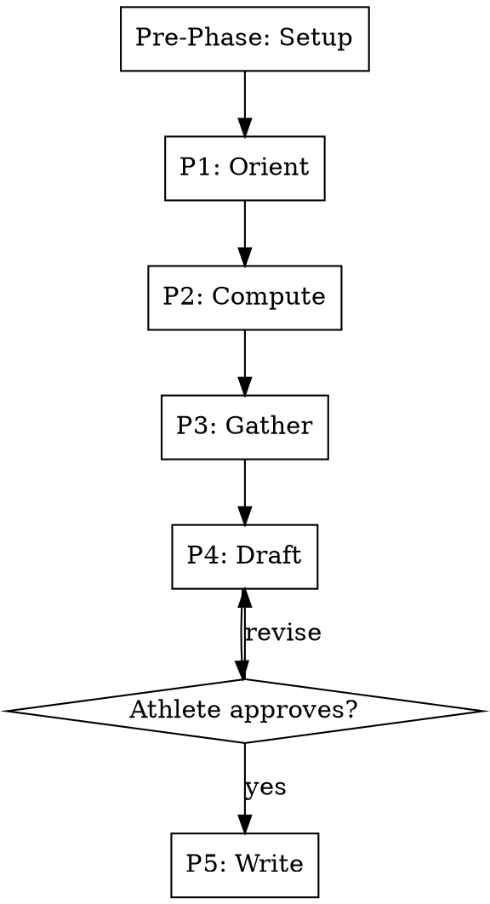

# Race Analysis

## Overview

Rigid five-phase workflow for analyzing a single race and producing `RACE_REPORT.md`. Combines computed stream analyses (fade, time-in-zone, decoupling, surge response, lap trends, sim comparison) with athlete narrative on fueling, intent, and qualitative experience. All time-series compute happens in CLI tools — no raw streams enter LLM context.

**This skill is RIGID — phases execute in exact order. Do not skip, reorder, or combine phases.**

## Workflow



---

### Pre-Phase Setup _(no user input — run silently)_

Follow **`${CLAUDE_PLUGIN_ROOT}/shared/setup.md`** — the shared configuration
preamble (paths, config, profile, persona, athlete profile).

**Optional steps this skill declares:** SEASON, MCP

Do not proceed past a stop condition defined there.


### Phase 1 — Orient _(no user input)_

Resolve target activity, fetch metadata, identify comparison sims. No streams yet.

1. **Resolve target activity:**
   - If athlete provided an activity ID, use it.
   - Otherwise, call `get_recent_activities(limit=10)`. Filter to race-typed or athlete-flagged-as-race entries. If exactly one candidate, confirm with athlete:
     > "Analyzing {activity_name} ({date}, {distance}km, {duration}). Correct?"
   - If multiple candidates, list them and ask the athlete to pick.

2. Call `get_activity_details(activity_id)` to extract: name, type, start time, distance, duration, FTP at time of activity.

3. Call `get_calendar_events` over a 14-day window centered on the race date. Identify the prescription targeting this race (look for matching event name, date, or `is_race: true` flag in YAML frontmatter). If found, read the prescription file and note the target zones, planned duration, planned fueling.

4. **Identify comparison sims:** call `get_recent_activities(days_back=42, limit=50)`, filter to:
   - Saturday activities
   - Within the date range of the immediately-preceding Race Specificity block (resolve from prescriptions_dir naming)
   - Duration ≥ 60% of race duration
   Take the 3 most recent matching activities. For each, call `get_activity_details` to extract `np`, `avg_hr`, `decoupling_pct` (set to 0 if not present — sim_compare handles missing decoupling), `duration_sec`, `start_date`. Build the `ActivitySummaryForCompare` array.

5. **Decide segmentation strategy:** if `duration_sec > 6 * 3600` → hourly (omit `--fade-segments` to use default), else `--fade-segments=4`.

6. **Announce findings:**
   > "Race identified: {name}, {duration}, FTP {ftp}W.
   > Prescription: {found / not found}.
   > Comparison sims: {N} found ({list dates}).
   > Segmentation: {hourly / quartiles}."

---

### Phase 2 — Compute _(no user input — shells out)_

Run two CLIs and capture their JSON output. NO raw stream data enters LLM context — only the parsed summaries.

1. **Build sim-compare target file (if sims found):**

   Call `get_activity_streams(activity_id)` for the target activity to compute its NP and avg HR via the stream-analyze tool itself, OR fetch via `get_activity_details` if available. (Prefer details — avoids a stream fetch.)

   Write `/tmp/sim-target-{race_id}.json`:
   ```json
   { "activity_id": "{race_id}", "date": "{race_date}", "np": {...}, "avg_hr": {...}, "decoupling_pct": 0, "duration_sec": {...} }
   ```

   Write `/tmp/sim-sims-{race_id}.json` as the array built in Phase 1 step 4.

2. **Run stream-analyze:**

   ```bash
   cd ${CLAUDE_PLUGIN_ROOT}/analysis-tools && npx tsx stream-analyze.ts \
     --activity-id={race_id} \
     --analyses=fade,time_in_zone,np_distribution,decoupling,hr_recovery,interval_cv,sim_compare,lap_trends \
     --ftp-override={ftp} \
     {--fade-segments=4 if quartiles, else omit} \
     {--sim-compare-target=/tmp/sim-target-{race_id}.json --sim-compare-sims=/tmp/sim-sims-{race_id}.json if sims found, else omit}
   ```

3. **Run race-context:**

   ```bash
   cd ${CLAUDE_PLUGIN_ROOT}/analysis-tools && npx tsx race-context.ts --activity-id={race_id}
   ```

4. **Assemble bundle:** parse both JSON outputs. For any analysis present in `output.errors`, drop it from the bundle and note the error for the draft phase.

5. **Announce health check (one line):**
   > "Compute complete. {N of 8} analyses succeeded, race-context loaded ({weather present / weather absent})."

---

### Phase 3 — Gather _(one question at a time — wait for each answer before asking the next)_

1. **Fueling timeline:**
   > "Walk me through what you ate and drank during the race — roughly when, what, and how much. Anything you missed or struggled with?"

2. **Race intent vs execution:**
   > "What was your plan going in? Where did you stick to it, and where did you deviate — deliberately or otherwise?"

3. **Where it got hard:**
   > "When did the race start to feel hard? What did 'hard' mean — legs, breathing, motivation, fueling, something else?"

4. **Surprises:**
   > "What surprised you, positively or negatively?"

5. **Off-record context:**
   > "Anything else from race day or the days leading in that the data wouldn't capture? Sleep, illness, weather acclimation, equipment, pre-race stress."

6. **Form explicit report conclusions:**
   From the computed bundle and gathered narrative, distill a small set of
   atomic, explicitly approved conclusions that bear on existing keyed
   state (for example, whether race execution confirms or contradicts the
   targeted prescription). Each conclusion is recorded as an entry of the
   `report_claims` array in the structured change set (`StructuredReportClaim`)
   with ALL of:
   - `entity_type`: `race-conclusion`
   - `key_components`: the exact canonical state entity it bears on
     (`entity_type` plus its durable identity components, e.g.
     `{ entity_type: prescription, arc_id, session_id }`)
   - `effective_at`: the effective time of the conclusion
   - `statement`: one-sentence human-readable claim
   - `source_document`: the relative path of the `RACE_REPORT.md` this
     conclusion comes from
   - `details`: the structured value of the conclusion

   Narrative sections of the report stay narrative — only these atomic
   conclusions become records.

---

### Phase 4 — Draft _(shown to athlete)_
Render the full `RACE_REPORT.md` using `templates/race-report.md` as the
skeleton. Fill every section from the Phase 2 bundle and Phase 3 answers.
Annotate any sections that were dropped due to errors (e.g., "Decoupling not
computed — duration <45min").

**Record preview — one combined approval:** alongside the full report draft,
call `engram_capture_preview({ change_set })` with the structured change set
containing the Phase 3 `report_claims`. Show the complete report AND the
record preview (the exact plan hash, each record's role/classification) to
the athlete together. The athlete approves BOTH the report text and the
capture plan under ONE approval; the approved plan hash is bound to this
exact content. Iterate on both until explicitly approved.

If the preview returns blocked errors, fix the change set and re-preview —
Phase 4 cannot complete without a ready plan hash.


---

### Phase 5 — Write _(with approval)_

1. Build the event slug: lowercase, hyphenated, from the activity name. Example: "Example Gravel Event" → `example-gravel-event`.

2. Create the directory:
   ```bash
   mkdir -p {coaching_docs_dir}/{season}/races/{YYYY-MM-DD}-{event-slug}/
   ```


3. Write the approved `RACE_REPORT.md` to that directory. **This document
   write happens FIRST and is the authoritative canonical report — it is
   never regenerated from records.** If this write fails for any reason,
   STOP: do not apply any records; report the failure to the athlete.

4. **Apply the approved capture plan:** only after the report write
   succeeded, call `engram_capture_apply({ plan_hash })` with the exact
   plan hash approved in Phase 4.
   - `status: "stale"` → the pending preview was discarded; return to
     Phase 4, re-preview, and get fresh approval.
   - Report any index or compatibility-view staleness from the result to
     the athlete (records remain authoritative either way); a stale index
     refresh is retried via the guarded mechanism, never by editing views.

5. **Auto-tail lessons-rollup:** invoke the `lessons-rollup` skill ONLY
   after BOTH the report document write AND the report claims apply
   succeeded:
   - `--source=race:{event-slug}`
   - The bullets from the report's "Calibration Points for Future Blocks"
     section as the append list.

   The rollup keeps its own harness-backed claim gate; the report is never
   reconstructed from the captured claims.

---

## Key Constraints

| Rule | Detail |
|------|--------|
| Rigid phases | Execute in order — no skipping, reordering, or combining |
| Approval gate | Nothing written until Phase 4 draft explicitly approved — report text and capture plan approved together under one approval |
| One question at a time | Phase 3 never batches questions |
| No raw streams in context | All time-series math runs in stream-analyze; skill consumes condensed JSON |
| Partial-data tolerance | Missing analyses (e.g., decoupling on short events, sim_compare with no sims) annotate and skip rather than failing the report |
| Canonical report first | Phase 5 writes `RACE_REPORT.md` FIRST; a failed document write stops before any record apply |
| Explicit conclusions only | Only the atomic `report_claims` from the approved change set become records; narrative stays in the document |
| Auto-tail rollup | Phase 5 invokes lessons-rollup only after BOTH the report write and claims apply succeed |
