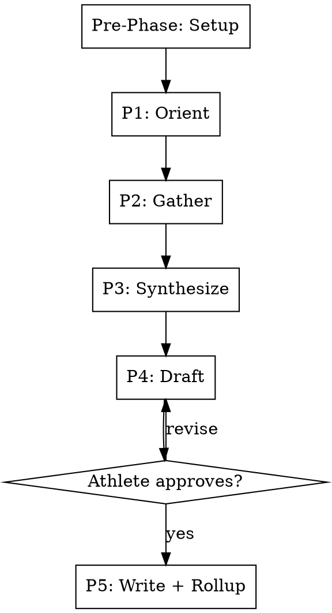

# Season Retrospective

## Overview

Rigid five-phase workflow for end-of-season synthesis. Reads existing block summaries and race reports (no per-activity computation), gathers the athlete's reflection on the arc, then constructs the season-level narrative — including a persona-fit assessment that drives next-season recommendations.

**This skill is RIGID — phases execute in exact order. Do not skip, reorder, or combine phases.**

## Workflow



---

### Pre-Phase Setup _(no user input — run silently)_

Resolve `{plugin_root}` before reading bundled assets:

1. If `CLAUDE_PLUGIN_ROOT` is non-empty, use its absolute value.
2. Otherwise (OMP), run `omp plugin list --json`, select the single enabled
   `npm` entry whose `name` is exactly `@isparling/engram-coach`, and use its
   absolute `path`.

Verify `{plugin_root}/shared/setup.md` exists. If resolution or verification
fails, stop and report the failure. Do not guess a package root by probing
sibling repositories, dot-directories, or unrelated configuration variables.

Then follow **`{plugin_root}/shared/setup.md`** — the shared configuration
preamble (paths, config, profile, persona, athlete profile).

**Optional steps this skill declares:** SEASON, MCP

Do not proceed past a stop condition defined there.


### Phase 1 — Orient _(no user input)_

Document reads and low-cost MCP calls only. No streams, no per-activity computation.

1. **Enumerate season contents:**
   - List `{coaching_docs_dir}/{season}/` → identify block directories and the `races/` directory.
   - For each block directory, check for `SUMMARY.md`. If absent, note as a gap.
   - List `{coaching_docs_dir}/{season}/races/` → enumerate race report directories.

2. **Read all block summaries** that exist.

3. **Read all race reports** that exist.

4. **Read intake record:** look for `{coaching_docs_dir}/intake/` or `{coaching_docs_dir}/{season}/intake.md`. Extract original goal, persona at season start, target date.

5. **Season-wide wellness trajectory:**
   - Compute `season_duration_days` from intake target date and earliest block start (or use the first block's `block_start`).
   - Call `get_wellness_data(days_back={season_duration_days + 1})`.
   - Extract MONTHLY summary points only: peak CTL per month, lowest TSB per month, end-of-month CTL. Do NOT load per-day data into reasoning.

6. **QMD context queries:**
   ```bash
   qmd query "{season} pivots"
   qmd query "{season} persona changes"

Follow `{plugin_root}/shared/retrieval.md` when constructing these — parameterize with the specifics below, and add queries for whatever this particular season actually raises.
   ```
   Surface major mid-season decisions (e.g., persona switched at week 12, planned A-race deferred).

7. **Block-coverage gap check:** if any block has no SUMMARY.md, ask:
   > "Block {name} has no SUMMARY.md. Run block-review for it first, or proceed without it?"

8. **Announce:**
   > "Season span: {start} → {end}. Blocks completed: {N} ({list}). Race reports: {N}.
   > Persona at start: {start_persona}. Persona at end: {end_persona}.
   > Original goal: {goal}. Outcome (per athlete intake or recent message): {one-line}.
   > Mid-season pivots: {summary}."

---

### Phase 2 — Gather _(one question at a time)_

1. **Goal achievement:**
   > "Looking back at what you set out to do at the start of this season — how did the actual outcome compare? Not just the result, but how it felt to get there."

2. **What worked:**
   > "What about your training do you most want to repeat next season? A specific block structure, a recovery pattern, a fueling approach, a persona fit — anything."

3. **What didn't:**
   > "What would you change — knowing what you know now, what would you do differently from week one?"

4. **Forward intent:**
   > "What's the next goal, and is it the same kind of goal as this one or a different shape entirely?"

---

### Phase 3 — Synthesize _(no user input — internal reasoning, no writes yet)_

Construct, but do not yet render:

1. **Arc narrative:** how blocks connected, where the load came from, where it peaked, how the taper went into the target event.

2. **Persona-fit assessment:** based on calibration points across blocks and athlete answers, did the active persona match how the athlete actually responded?
   - Yes → cite supporting evidence.
   - No → which persona's philosophy would have produced equal-or-better outcomes? What evidence?
   - This is the highest-value cross-block insight — be specific.

3. **Goal-vs-outcome diagnosis:**
   - Missed goal → what was the limiter? Cite specific data (race report fade, block summary HRV trends, etc.).
   - Met or exceeded → what overperformed and is it durable? Or anomalous (e.g., favorable conditions)?

4. **Cross-block patterns:** scan all block summaries' "Calibration Points for Future Blocks" sections. Items that appear in 2+ blocks (semantically — paraphrasing acceptable) are durable patterns. List them with sources.

5. **Race-report integration:** what did the races reveal that block summaries alone wouldn't?

6. **Form explicit report conclusions:** distill the atomic, explicitly
   approved conclusions of the season review — facts that bear on existing
   keyed state (persona fit verdicts, durable cross-block patterns tied to
   thresholds or monitoring concerns). Each conclusion is recorded as an
   entry of the `report_claims` array in the structured change set
   (`StructuredReportClaim`) with ALL of:
   - `entity_type`: `season-conclusion`
   - `key_components`: the exact canonical state entity it bears on
     (`entity_type` plus its durable identity components)
   - `effective_at`: the effective time of the conclusion
   - `statement`: one-sentence human-readable claim
   - `source_document`: the relative path of the `SEASON_REVIEW.md` this
     conclusion comes from
   - `details`: the structured value of the conclusion

   Narrative sections stay narrative — only these atomic conclusions
   become records.

---

### Phase 4 — Draft _(shown to athlete)_

Render the full `SEASON_REVIEW.md` using `templates/season-review.md` as the
skeleton. Fill every section.

The "Calibration Points to Promote" section at the bottom is the explicit
list of bullets that will be passed to `lessons-rollup`. Bar is higher than
block-level — only cross-block patterns confirmed by race execution OR
pattern repetition across 2+ blocks.

**Record preview — one combined approval:** alongside the full report draft,
call `engram_capture_preview({ change_set })` with the structured change set
containing the Phase 3 `report_claims`. Show the complete report AND the
record preview (the exact plan hash, each record's role/classification) to
the athlete together. The athlete approves BOTH the report text and the
capture plan under ONE approval; the approved plan hash is bound to this
exact content. Iterate on both until explicitly approved. If the preview is
blocked, fix the change set and re-preview — this phase cannot complete
without a ready plan hash.


---

### Phase 5 — Write + Rollup _(with approval)_


1. Write `{coaching_docs_dir}/{season}/SEASON_REVIEW.md`. **This document
   write happens FIRST and is the authoritative canonical season review —
   it is never regenerated from records.** If this write fails for any
   reason, STOP: do not apply any records; report the failure to the athlete.

2. **Apply the approved capture plan:** only after the document write
   succeeded, call `engram_capture_apply({ plan_hash })` with the exact
   plan hash approved in Phase 4.
   - `status: "stale"` → the pending preview was discarded; return to
     Phase 4, re-preview, and get fresh approval.
   - Report any index or compatibility-view staleness from the result to
     the athlete (records remain authoritative either way); a stale index
     refresh is retried via the guarded mechanism, never by editing views.

3. **Auto-tail lessons-rollup** ONLY after BOTH the document write AND the
   report claims apply succeeded:
   - `--source=season:{season}`
   - The "Calibration Points to Promote" bullets as the append list.
   Non-additive diffs gate on approval. The rollup keeps its own
   harness-backed claim gate; the review is never reconstructed from the
   captured claims.

---

## Key Constraints

| Rule | Detail |
|------|--------|
| Rigid phases | Execute in order — no skipping, reordering, or combining |
| Approval gate | Nothing written until Phase 4 draft explicitly approved — report text and capture plan approved together under one approval |
| No per-activity compute | All stream-derived signals come from existing block summaries and race reports |
| Wellness data is monthly-summarized | Season wellness trajectory loads only monthly summary points, never per-day |
| Partial-coverage tolerance | Missing block summaries are flagged and the season retrospective continues with a gap annotation |
| Canonical report first | Phase 5 writes `SEASON_REVIEW.md` FIRST; a failed document write stops before any record apply |
| Explicit conclusions only | Only the atomic `report_claims` from the approved change set become records; narrative stays in the document |
| Auto-tail rollup | lessons-rollup runs only after BOTH the document write and claims apply succeed |
