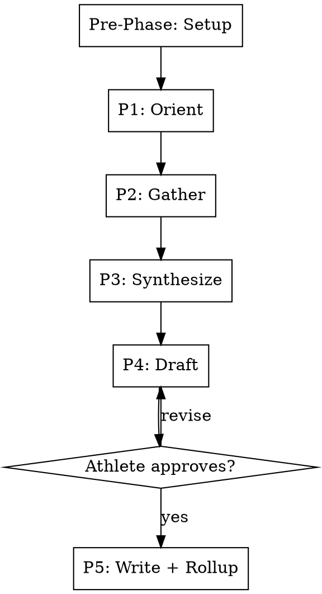

# Season Retrospective

## Overview

Rigid five-phase workflow for end-of-season synthesis. Reads existing block summaries and race reports (no per-activity computation), gathers the athlete's reflection on the arc, then constructs the season-level narrative — including a persona-fit assessment that drives next-season recommendations.

**This skill is RIGID — phases execute in exact order. Do not skip, reorder, or combine phases.**

## Workflow



---

### Pre-Phase Setup _(no user input — run silently)_

Follow **`${CLAUDE_PLUGIN_ROOT}/shared/setup.md`** — the shared configuration
preamble (paths, config, profile, persona, athlete profile).

**Optional steps this skill declares:** SEASON, MCP

Do not proceed past a stop condition defined there.


### Phase 1 — Orient _(no user input)_

Document reads and low-cost MCP calls only. No streams, no per-activity computation.

1. **Enumerate season contents:**
   - List `{coaching_docs_dir}/{season}/` → identify block directories and the `races/` directory.
   - For each block directory, check for `SUMMARY.md`. If absent, note as a gap.
   - List `{coaching_docs_dir}/{season}/races/` → enumerate race report directories.

2. **Read all block summaries** that exist.

3. **Read all race reports** that exist.

4. **Read intake record:** look for `{coaching_docs_dir}/intake/` or `{coaching_docs_dir}/{season}/intake.md`. Extract original goal, persona at season start, target date.

5. **Season-wide wellness trajectory:**
   - Compute `season_duration_days` from intake target date and earliest block start (or use the first block's `block_start`).
   - Call `get_wellness_data(days_back={season_duration_days + 1})`.
   - Extract MONTHLY summary points only: peak CTL per month, lowest TSB per month, end-of-month CTL. Do NOT load per-day data into reasoning.

6. **QMD context queries:**
   ```bash
   qmd query "{season} pivots"
   qmd query "{season} persona changes"

Follow `${CLAUDE_PLUGIN_ROOT}/shared/retrieval.md` when constructing these — parameterize with the specifics below, and add queries for whatever this particular season actually raises.
   ```
   Surface major mid-season decisions (e.g., persona switched at week 12, planned A-race deferred).

7. **Block-coverage gap check:** if any block has no SUMMARY.md, ask:
   > "Block {name} has no SUMMARY.md. Run block-review for it first, or proceed without it?"

8. **Announce:**
   > "Season span: {start} → {end}. Blocks completed: {N} ({list}). Race reports: {N}.
   > Persona at start: {start_persona}. Persona at end: {end_persona}.
   > Original goal: {goal}. Outcome (per athlete intake or recent message): {one-line}.
   > Mid-season pivots: {summary}."

---

### Phase 2 — Gather _(one question at a time)_

1. **Goal achievement:**
   > "Looking back at what you set out to do at the start of this season — how did the actual outcome compare? Not just the result, but how it felt to get there."

2. **What worked:**
   > "What about your training do you most want to repeat next season? A specific block structure, a recovery pattern, a fueling approach, a persona fit — anything."

3. **What didn't:**
   > "What would you change — knowing what you know now, what would you do differently from week one?"

4. **Forward intent:**
   > "What's the next goal, and is it the same kind of goal as this one or a different shape entirely?"

---

### Phase 3 — Synthesize _(no user input — internal reasoning, no writes yet)_

Construct, but do not yet render:

1. **Arc narrative:** how blocks connected, where the load came from, where it peaked, how the taper went into the target event.

2. **Persona-fit assessment:** based on calibration points across blocks and athlete answers, did the active persona match how the athlete actually responded?
   - Yes → cite supporting evidence.
   - No → which persona's philosophy would have produced equal-or-better outcomes? What evidence?
   - This is the highest-value cross-block insight — be specific.

3. **Goal-vs-outcome diagnosis:**
   - Missed goal → what was the limiter? Cite specific data (race report fade, block summary HRV trends, etc.).
   - Met or exceeded → what overperformed and is it durable? Or anomalous (e.g., favorable conditions)?

4. **Cross-block patterns:** scan all block summaries' "Calibration Points for Future Blocks" sections. Items that appear in 2+ blocks (semantically — paraphrasing acceptable) are durable patterns. List them with sources.

5. **Race-report integration:** what did the races reveal that block summaries alone wouldn't?

---

### Phase 4 — Draft _(shown to athlete)_

Render the full `SEASON_REVIEW.md` using `templates/season-review.md` as the skeleton. Fill every section. Iterate until explicitly approved.

The "Calibration Points to Promote" section at the bottom is the explicit list of bullets that will be passed to `lessons-rollup`. Bar is higher than block-level — only cross-block patterns confirmed by race execution OR pattern repetition across 2+ blocks.

---

### Phase 5 — Write + Rollup _(with approval)_

1. Write `{coaching_docs_dir}/{season}/SEASON_REVIEW.md`.

2. **Auto-tail lessons-rollup** with:
   - `--source=season:{season}`
   - The "Calibration Points to Promote" bullets as the append list.
   Non-additive diffs gate on approval.


3. **QMD index update:**
   ```bash
   qmd update && qmd embed
   ```

---

## Key Constraints

| Rule | Detail |
|------|--------|
| Rigid phases | Execute in order — no skipping, reordering, or combining |
| Approval gate | Nothing written until Phase 4 draft explicitly approved |
| No per-activity compute | All stream-derived signals come from existing block summaries and race reports |
| Wellness data is monthly-summarized | Season wellness trajectory loads only monthly summary points, never per-day |
| Partial-coverage tolerance | Missing block summaries are flagged and the season retrospective continues with a gap annotation |
| Auto-tail rollup | Phase 5 invokes lessons-rollup with cross-block patterns as the promotion list |
