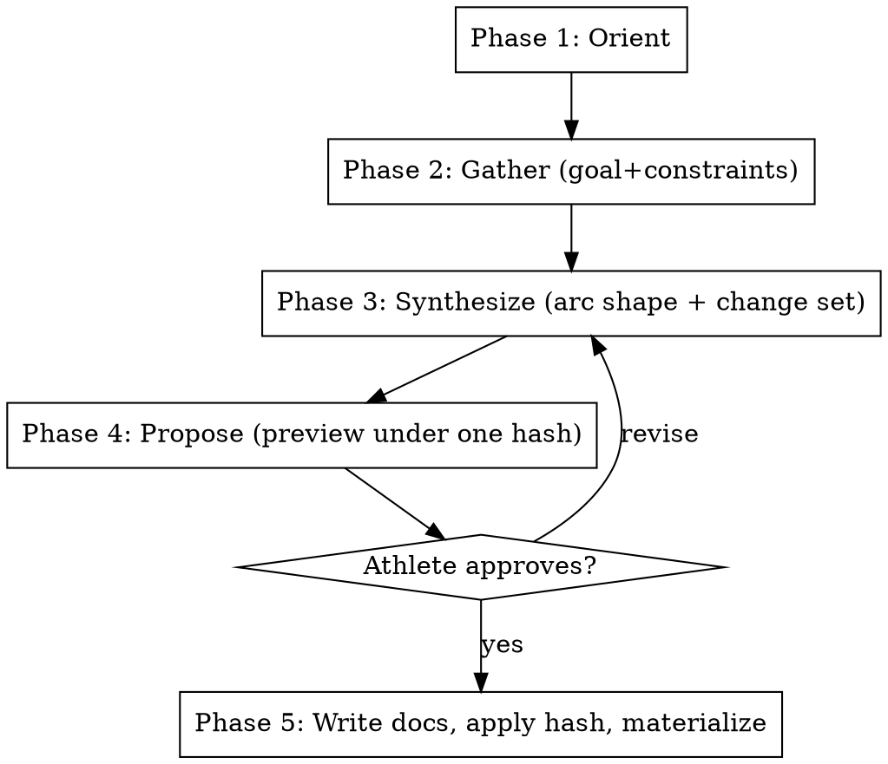

# Set Goal

## Overview

Workflow for establishing a new training arc toward a new goal. An "arc" is the multi-block journey from now to a target event (or fitness-maintenance goal). Decomposes into 2-4 named sub-blocks, each with its own methodology document; prescription state lives as structured records keyed by arc and durable session id. The arc is the unit of season-level planning; sub-blocks are the unit of `adapt-plan` and `block-review`.

**Authority split:** the arc-overview document and every methodology document are canonical, approved documents this skill writes itself. Prescription YAML and consultation logs are GENERATED compatibility views rendered from active Engram records by materialization — never write or edit them directly.

**This skill is RIGID — phases execute in exact order. Do not skip, reorder, or combine phases.**

**When to use this skill vs. others:**
- `intake` — one-time athlete onboarding (persona, paths, season). Run once per athlete.
- `set-goal` — recurring "what's next" planning at season transitions, post-race, or when goals change. Produces a full arc with methodology docs plus structured prescription records.
- `consult` — advisory within an existing plan. Appends a consultation event and targeted prescription edits, not a full arc.
- `adapt-plan` — per-session post-workout adaptation.

## Workflow



---

### Pre-Phase Setup _(no user input — run silently)_

Resolve `{plugin_root}` before reading bundled assets:

1. If `CLAUDE_PLUGIN_ROOT` is non-empty, use its absolute value.
2. Otherwise (OMP), run `omp plugin list --json`, select the single enabled
   `npm` entry whose `name` is exactly `@isparling/engram-coach`, and use its
   absolute `path`.

Verify `{plugin_root}/shared/setup.md` exists. If resolution or verification
fails, stop and report the failure. Do not guess a package root by probing
sibling repositories, dot-directories, or unrelated configuration variables.

Then follow **`{plugin_root}/shared/setup.md`** — the shared configuration
preamble (paths, config, profile, persona, athlete profile).

**Optional steps this skill declares:** PRESCRIPTIONS, SEASON, MCP

Do not proceed past a stop condition defined there.


### Phase 1 — Orient _(no user input)_

Read silently and announce findings before asking anything.

1. **Recent block reviews** — find the most recent `SUMMARY.md` files under `{coaching_docs_dir}/{season}/*/SUMMARY.md`. Read up to 3 most recent.
2. **Recent race reports** — find the most recent `RACE_REPORT.md` files under `{coaching_docs_dir}/{season}/races/*/RACE_REPORT.md`. Read up to 2 most recent.
3. **Active prescription check** — read the active generated prescription view(s) under `prescriptions_dir`. Find the session with the most recent `session_date`. Note when that block ended (most recent date) and how many days have elapsed since.
4. **Current fitness state** — call `get_fitness_summary` via Intervals.icu MCP to retrieve current CTL, ATL, TSB.
5. **QMD history search**:
   - `qmd query "arc planning"` and `qmd query "next block"` — surface any prior arc-planning records
   - `qmd query "{persona} {modality}"` — surface persona-modality fit notes from ATHLETE_PROFILE

Follow `{plugin_root}/shared/retrieval.md` when constructing these — parameterize with the specifics below, and add queries for whatever this particular goal actually raises.

Announce findings before Phase 2. Surface:
- Days since last race or block-end
- Current CTL/ATL/TSB
- Persona-fit notes for likely-relevant modalities
- Any prior arc-planning patterns from QMD

---

### Phase 2 — Gather _(one question at a time)_

Ask only what cannot be inferred from the orient findings. **Ask one question at a time. Wait for each answer before asking the next.**

Required information by end of Phase 2:

1. **The goal.** Specific event (name + date + modality) OR fitness-maintenance goal (description + horizon).
2. **Modality specifics.** Bike type / sport / specific equipment if relevant. Locked vs leaning.
3. **Recovery status.** How the athlete is feeling now. Days since last race; subjective sense of readiness to start.
4. **Calendar constraints.** Major events, vacations, work-travel, family commitments between now and the target. Both opportunities (3-day weekends, vacation that can absorb volume) and obstacles (travel that blocks training).
5. **Time budget.** Typical training-week structure. Weekday availability, weekend long-ride capacity, non-negotiables (e.g., recurring group rides, family commitments).
6. **Lifestyle/modality preferences.** Outdoor vs indoor preference, strong likes/dislikes, anything that should shape the prescription style.

Some of these may be obvious from the Orient findings (e.g., ATHLETE_PROFILE already records modality and persona-fit). If so, confirm rather than ask blind.

---

### Phase 3 — Synthesize _(shown to athlete)_

Reason aloud about arc shape before proposing anything. Cover:

1. **Goal framing.** What the goal requires physiologically (durability, peak power, specific modality stress) and how it differs from prior goals the athlete has trained for.
2. **Persona-fit.** Whether the active persona is the right tool for this goal. Reference ATHLETE_PROFILE persona-fit notes. If a persona change is warranted, surface it explicitly here (and recommend re-running `intake` if so).
3. **Calendar mapping.** Map the calendar constraints from Phase 2 onto the time-to-goal window. Identify natural volume opportunities (vacations, long weekends) and structural obstacles.
4. **Arc shape proposal — sub-block decomposition.** Propose 2-4 named sub-blocks. Each sub-block should be 1-5 weeks. Total arc length matches time-to-goal. Sub-block names should be descriptive (`reengage`, `volume`, `camp`, `taper` or `base`, `build`, `race-specificity`, `taper` — whatever fits the arc).
5. **Modality split across the arc.** How time/volume distributes across training modalities (e.g., trainer/outdoor, ride/walk, geared/SS).
6. **Carryover lessons.** Specifically cite ATHLETE_PROFILE entries that should shape the arc (`[race:...]`, `[block-review:...]` tags).
7. **Key tradeoffs.** What this arc is choosing to NOT do vs. a "textbook" approach for the goal, and why those choices fit this athlete.

This phase is **explanatory** about coaching reasoning — but while reasoning,
build the complete structured change set IN PARALLEL so Phase 4 can preview it:

**Durable session identity.** Generate each session's durable `session_id` ONCE
(any stable unique slug, e.g. `ses{year}w{week}{day}`) and reuse that exact
value in EVERY place the session appears: its prescription state item, its
workout reference, narrative text, and the arc overview outline. The
`session_date`, week position, title, and workout contents are MUTABLE
attributes — rescheduling a session later changes those attributes but never
its `session_id` or identity.

**The change set.** Assemble ONE `StructuredChangeSet` covering the complete
graph:

- One prescription state item per planned session. `key_components` MUST carry
  BOTH `arc_id` (the snake_case arc name) AND that session's durable
  `session_id`; `details` carries the FULL prescription value for the session
  (week, day, session date, name, modality, duration, effort zone or interval
  structure, plus the shared arc goal object). Every session gets a complete
  value — no placeholders to be filled in later.
- Optionally one consultation event capturing significant goal-setting
  reasoning that does not fit the methodology documents (the kickoff note),
  with `action_targets` naming the affected durable session ids.
- Explicit report claims for the conclusions embedded in the documents you are
  about to write: one `arc-conclusion` claim anchored to the arc's first
  prescription entity, and one `methodology-conclusion` claim per sub-block
  anchored to a representative session of that sub-block. Each claim carries
  its intended `source_document` path.

The skill NEVER assigns record IDs, relationships (supersedes/refines/
supports), statuses, or retirement targets — those are derived and owned by
the pack during preview. If any session cannot be given a durable, unique
`session_id`, stop and resolve that here; an unbound session must never reach
Phase 4.

---

### Phase 4 — Propose _(requires explicit approval of ONE hash)_

Convert Phase 3 reasoning into a concrete arc structure, then bind everything
to a single approval:

1. **Preview FIRST.** Before presenting anything, call `engram_capture_preview`
   with the complete change set. The pack derives every canonical entity key,
   reconciles against active records, and returns the exact mutation plan plus
   its `plan_hash`.
2. **Check the preview.** Every prescription key must be bound —
   `prescription:{arc_id}:{session_id}` with both components present. If ANY
   session key came back unbound or ambiguous (or the preview is blocked),
   CORRECT THE GRAPH (fix the `session_id`s / `arc_id`) and call
   `engram_capture_preview` AGAIN. Never ask for approval against a blocked or
   partially-bound preview.
3. **Present together, under one approval:**
   - For each sub-block: **Block name** (snake_case), **Dates** (start → end),
     **Duration in weeks**, **Intent**, **Weekly structure outline**, and
     **Success criteria**.
   - The proposed **Arc name**, **Goal block**, and the canonical documents to
     be written: the arc-overview document and each methodology document.
   - The exact record mutations from the preview: which records will be
     created (new prescription states, the kickoff consultation event, and the
     arc/methodology report claims).
   - The generated compatibility-view paths materialization will produce from
     those records (the arc's prescription view and the consultation log) —
     presented as outputs of apply, never as files you will write by hand.
   - The exact **plan hash**.
4. Wait for **explicit approval, rejection, or modification**. Approval covers
   BOTH the coaching proposal AND the record/artifact mutations under that
   hash. Iterate: any modification returns to Phase 3 to rebuild the change
   set, re-previews, and presents a NEW hash. Do not write any files until the
   athlete approves the current hash.

---

### Phase 5 — Write canonical documents, then apply _(with approval)_

Execute in this order.

**1. Arc directory + canonical documents.** Create the arc directory and write
the two kinds of CANONICAL, approved documents exactly as approved:

**Arc overview doc** — `{coaching_docs_dir}/{season}/{arc_name}/arc-overview.md`

Frontmatter:
```yaml
---
type: arc-overview
season: {season}
arc: {arc_name}
target_event: {event name}
target_date: {date}
modality: {modality}
persona: {active_persona}
---
```

Body covers:
- Why this arc exists; what it differs from prior arcs
- Arc shape table (sub-block / weeks / dates / intent) — reference sessions by their durable `session_id`
- Modality split across the arc
- Success criteria (race outcome + mid-arc fitness markers)
- Brake signals (arc-level)
- Carryover lessons embedded in the arc (cite ATHLETE_PROFILE tags)
- Open questions / mid-arc checkpoints
- File index (lists the methodology documents and notes that prescription/consultation views generate from records)

**Per-sub-block methodology doc** — for each sub-block, write `{coaching_docs_dir}/{season}/{arc_name}/{sub_block_name}-methodology.md`

Frontmatter:
```yaml
---
type: methodology
season: {season}
arc: {arc_name}
sub_block: {sub_block_name}
dates: {start} to {end}
duration_weeks: {N}
---
```

Body covers:
- Context (what state the athlete is in entering this sub-block)
- Goal (one or two sentences)
- Why this sub-block is shaped this way (vs. a generic approach for the same role)
- Weekly structure pattern
- Progression through the sub-block (if multi-week)
- Key session rationale
- Success criteria
- Brake signals specific to this sub-block

These documents are the skill's direct writes. Do NOT write prescription YAML
or consultation logs — they are generated compatibility views.

**2. Apply the approved hash.** Call `engram_capture_apply` with the exact
plan hash the athlete approved. The core commits the active records, retires
anything superseded, runs the guarded qmd refresh, and invokes the pack
materializers, which GENERATE the prescription YAML view and the consultation
log from the newly active records.

- On success, collect the committed record IDs and the regenerated artifact
  paths for the completion summary.
- If the apply reports the plan as STALE (records changed after approval), do
  not retry blindly: return to Phase 4, re-preview the same change set, present
  the new hash, and obtain fresh approval.
- Records commit authoritatively even if index refresh or materialization
  hiccups; report any stale view honestly and retry apply with the SAME hash
  if only materialization needs a rerun.

**3. Completion summary** — output, with the EXACT record IDs from the applied
plan and the EXACT generated view paths:

```
✓ Arc established: {arc_name}

Target:           {event} — {date} ({modality})
Sub-blocks:       {count} ({list of names})
Arc dates:        {start} → {end}
Coaching docs:    {coaching_docs_dir}/{season}/{arc_name}/
Records created:  {committed record IDs, grouped as states/event/claims}
Generated views:  {prescription view path}, {consultation log path}

Next steps:
  1. {first sub-block name} starts {date}
  2. Invoke engram-coach:adapt-plan after first key session
  3. Invoke engram-coach:consult mid-{first sub-block} for check-in (or sooner if signals diverge)
  4. Invoke engram-coach:block-review at each sub-block boundary
```

---

## Key Constraints

| Rule | Detail |
|---|---|
| Rigid phases | Execute in order — no skipping, reordering, or combining |
| Approval gate | Nothing written until Phase 4 explicitly approves the exact plan hash |
| One question at a time | Phase 2 never batches questions |
| Synthesis before proposal | Phase 3 must complete (including the change set) before Phase 4 begins |
| Sub-block decomposition required | Never prescribe a single multi-month block. Always decompose into 2-4 named sub-blocks of 1-5 weeks each. |
| Canonical vs generated | Arc-overview and methodology documents are canonical and written by this skill; prescription YAML and consultation logs are generated views produced only by materialization — never write or edit them directly. |
| Durable session identity | Generate each `session_id` once; reuse it everywhere. Rescheduling mutates dates/titles, never identity. Prescription keys always carry both `arc_id` and `session_id`. |
| One hash binds all | Documents, record mutations, and generated paths are approved together under one plan hash; a stale apply returns to Phase 4 for a fresh preview and approval. |
| No record internals | The skill never chooses record IDs, relationships, statuses, or retirement targets — the pack derives them at preview. |
| Persona-change escalation | If Phase 3 identifies a persona mismatch, recommend re-running `intake` before continuing. Do not silently shift persona. |
| Knowledge compounds | Arc-overview and methodology docs are durable artifacts; structured claims and consultation events build on them. Future Orient phases benefit from the structured separation. |

---

## When NOT to use this skill

- **For per-session adjustments** → use `adapt-plan` instead. set-goal is for arc-level planning, not session edits.
- **For mid-arc advice without restructuring** → use `consult` instead. set-goal rewrites the arc; consult appends to it.
- **For initial athlete onboarding** → use `intake` instead. set-goal assumes config.json + persona + paths are already set.
- **When the existing arc is still on track** → don't run set-goal "just to refresh." Run it when the goal changes or the prior arc has concluded.
