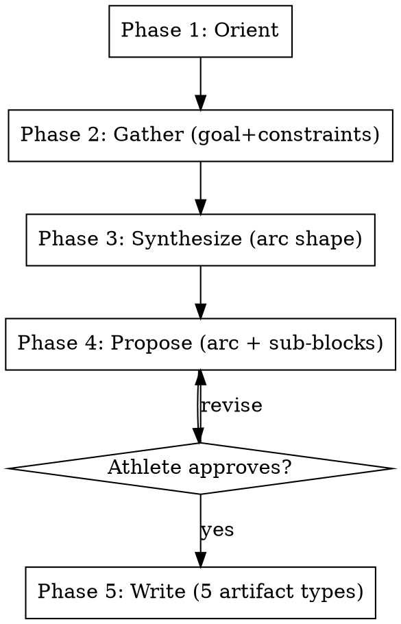

# Set Goal

## Overview

Workflow for establishing a new training arc toward a new goal. An "arc" is the multi-block journey from now to a target event (or fitness-maintenance goal). Decomposes into 2-4 named sub-blocks, each with its own methodology doc and prescription YAML. The arc is the unit of season-level planning; sub-blocks are the unit of `adapt-plan` and `block-review`.

**This skill is RIGID — phases execute in exact order. Do not skip, reorder, or combine phases.**

**When to use this skill vs. others:**
- `intake` — one-time athlete onboarding (persona, paths, season). Run once per athlete.
- `set-goal` — recurring "what's next" planning at season transitions, post-race, or when goals change. Produces a full arc with methodology docs + prescriptions.
- `consult` — advisory within an existing plan. Produces a consultation log entry and targeted prescription edits, not a full arc.
- `adapt-plan` — per-session post-workout adaptation.

## Workflow



---

### Pre-Phase Setup _(no user input — run silently)_

Follow **`${CLAUDE_PLUGIN_ROOT}/shared/setup.md`** — the shared configuration
preamble (paths, config, profile, persona, athlete profile).

**Optional steps this skill declares:** PRESCRIPTIONS, SEASON, MCP

Do not proceed past a stop condition defined there.


### Phase 1 — Orient _(no user input)_

Read silently and announce findings before asking anything.

1. **Recent block reviews** — find the most recent `SUMMARY.md` files under `{coaching_docs_dir}/{season}/*/SUMMARY.md`. Read up to 3 most recent.
2. **Recent race reports** — find the most recent `RACE_REPORT.md` files under `{coaching_docs_dir}/{season}/races/*/RACE_REPORT.md`. Read up to 2 most recent.
3. **Active prescription check** — list YAML files in `prescriptions_dir`. Find the file with the most recent `session_date`. Note when that block ended (most recent date) and how many days have elapsed since.
4. **Current fitness state** — call `get_fitness_summary` via Intervals.icu MCP to retrieve current CTL, ATL, TSB.
5. **QMD history search**:
   - `qmd query "arc planning"` and `qmd query "next block"` — surface any prior arc-planning records
   - `qmd query "{persona} {modality}"` — surface persona-modality fit notes from ATHLETE_PROFILE

Follow `${CLAUDE_PLUGIN_ROOT}/shared/retrieval.md` when constructing these — parameterize with the specifics below, and add queries for whatever this particular goal actually raises.

Announce findings before Phase 2. Surface:
- Days since last race or block-end
- Current CTL/ATL/TSB
- Persona-fit notes for likely-relevant modalities
- Any prior arc-planning patterns from QMD

---

### Phase 2 — Gather _(one question at a time)_

Ask only what cannot be inferred from the orient findings. **Ask one question at a time. Wait for each answer before asking the next.**

Required information by end of Phase 2:

1. **The goal.** Specific event (name + date + modality) OR fitness-maintenance goal (description + horizon).
2. **Modality specifics.** Bike type / sport / specific equipment if relevant. Locked vs leaning.
3. **Recovery status.** How the athlete is feeling now. Days since last race; subjective sense of readiness to start.
4. **Calendar constraints.** Major events, vacations, work-travel, family commitments between now and the target. Both opportunities (3-day weekends, vacation that can absorb volume) and obstacles (travel that blocks training).
5. **Time budget.** Typical training-week structure. Weekday availability, weekend long-ride capacity, non-negotiables (e.g., recurring group rides, family commitments).
6. **Lifestyle/modality preferences.** Outdoor vs indoor preference, strong likes/dislikes, anything that should shape the prescription style.

Some of these may be obvious from the Orient findings (e.g., ATHLETE_PROFILE already records modality and persona-fit). If so, confirm rather than ask blind.

---

### Phase 3 — Synthesize _(shown to athlete)_

Reason aloud about arc shape before proposing anything. Cover:

1. **Goal framing.** What the goal requires physiologically (durability, peak power, specific modality stress) and how it differs from prior goals the athlete has trained for.
2. **Persona-fit.** Whether the active persona is the right tool for this goal. Reference ATHLETE_PROFILE persona-fit notes. If a persona change is warranted, surface it explicitly here (and recommend re-running `intake` if so).
3. **Calendar mapping.** Map the calendar constraints from Phase 2 onto the time-to-goal window. Identify natural volume opportunities (vacations, long weekends) and structural obstacles.
4. **Arc shape proposal — sub-block decomposition.** Propose 2-4 named sub-blocks. Each sub-block should be 1-5 weeks. Total arc length matches time-to-goal. Sub-block names should be descriptive (`reengage`, `volume`, `camp`, `taper` or `base`, `build`, `race-specificity`, `taper` — whatever fits the arc).
5. **Modality split across the arc.** How time/volume distributes across training modalities (e.g., trainer/outdoor, ride/walk, geared/SS).
6. **Carryover lessons.** Specifically cite ATHLETE_PROFILE entries that should shape the arc (`[race:...]`, `[block-review:...]` tags).
7. **Key tradeoffs.** What this arc is choosing to NOT do vs. a "textbook" approach for the goal, and why those choices fit this athlete.

This phase is **explanatory**. No artifacts written yet. The athlete can push back before Phase 4.

---

### Phase 4 — Propose _(requires explicit approval)_

Convert Phase 3 reasoning into a concrete arc structure. For each sub-block, state:

- **Block name** (snake_case; will become `block_name` field in YAML and file basename)
- **Dates** (start → end)
- **Duration in weeks**
- **Intent** (one or two sentences)
- **Weekly structure outline** (key sessions, dominant modality)
- **Success criteria** (what observable signals confirm the sub-block worked)

Also propose:

- **Arc name** (snake_case; will be the directory name under `{coaching_docs_dir}/{season}/`)
- **Goal block** for prescription YAMLs (event/date/description)
- **YAML scope** — write all sub-blocks upfront, or only the first 1-2? Recommend upfront unless the athlete prefers per-block lock-in.

Wait for **explicit approval, rejection, or modification**. Iterate on Phase 4 as needed. Do not write any files until the athlete approves.

---

### Phase 5 — Write _(with approval)_

Write the following artifacts. Create intermediate directories as needed.

**1. Arc directory**
```
mkdir -p {coaching_docs_dir}/{season}/{arc_name}/
```

**2. Arc overview doc** — `{coaching_docs_dir}/{season}/{arc_name}/arc-overview.md`

Frontmatter:
```yaml
---
type: arc-overview
season: {season}
arc: {arc_name}
target_event: {event name}
target_date: {date}
modality: {modality}
persona: {active_persona}
---
```

Body covers:
- Why this arc exists; what it differs from prior arcs
- Arc shape table (sub-block / weeks / dates / intent)
- Modality split across the arc
- Success criteria (race outcome + mid-arc fitness markers)
- Brake signals (arc-level)
- Carryover lessons embedded in the arc (cite ATHLETE_PROFILE tags)
- Open questions / mid-arc checkpoints
- File index (lists the methodology docs + prescription YAMLs)

**3. Per-sub-block methodology doc** — for each sub-block, write `{coaching_docs_dir}/{season}/{arc_name}/{sub_block_name}-methodology.md`

Frontmatter:
```yaml
---
type: methodology
season: {season}
arc: {arc_name}
sub_block: {sub_block_name}
dates: {start} to {end}
duration_weeks: {N}
---
```

Body covers:
- Context (what state the athlete is in entering this sub-block)
- Goal (one or two sentences)
- Why this sub-block is shaped this way (vs. a generic approach for the same role)
- Weekly structure pattern
- Progression through the sub-block (if multi-week)
- Key session rationale
- Success criteria
- Brake signals specific to this sub-block

**4. Per-sub-block prescription YAML** — for each sub-block, write `{prescriptions_dir}/{arc_name}_{sub_block_name}.yaml`

Follow `PRESCRIPTION_FORMAT.md` schema. Include `goal` block referencing the arc target. Use `block_name: {arc_name}_{sub_block_name}` (snake_case). Renumber `week` to be 1-indexed within the sub-block (not within the arc). Use absolute `session_date` values.

**5. Scaffold consultations.md per sub-block** — for each sub-block, create an empty consultations log:
`{coaching_docs_dir}/{season}/{arc_name}/{sub_block_name}-consultations.md`

Frontmatter:
```yaml
---
type: consultations
season: {season}
arc: {arc_name}
sub_block: {sub_block_name}
---
```

Body starts as a single heading:
```markdown
# {Arc} — {Sub-block} Consultations

_(empty — append entries via engram-coach:consult or engram-coach:adapt-plan)_
```

**6. Optional: kickoff consultation entry**

If this `set-goal` invocation surfaced significant goal-setting reasoning beyond the methodology docs (e.g., the athlete articulated constraints that don't naturally fit in methodology), record an initial entry in the first sub-block's consultations.md. Otherwise skip — the methodology docs and arc overview carry the reasoning.

**7. qmd update**
```bash
qmd update
```

**8. Completion summary** — output:

```
✓ Arc established: {arc_name}

Target:           {event} — {date} ({modality})
Sub-blocks:       {count} ({list of names})
Arc dates:        {start} → {end}
Coaching docs:    {coaching_docs_dir}/{season}/{arc_name}/
Prescriptions:    {prescriptions_dir}/{arc_name}_*.yaml

Next steps:
  1. {first sub-block name} starts {date}
  2. Invoke engram-coach:adapt-plan after first key session
  3. Invoke engram-coach:consult mid-{first sub-block} for check-in (or sooner if signals diverge)
  4. Invoke engram-coach:block-review at each sub-block boundary
```

---

## Key Constraints

| Rule | Detail |
|---|---|
| Rigid phases | Execute in order — no skipping, reordering, or combining |
| Approval gate | Nothing written until Phase 4 explicitly approved |
| One question at a time | Phase 2 never batches questions |
| Synthesis before proposal | Phase 3 must complete before Phase 4 begins |
| Sub-block decomposition required | Never write a single multi-month prescription. Always decompose into 2-4 named sub-blocks of 1-5 weeks each. |
| Methodology + prescription together | Every sub-block gets both a methodology.md AND a prescription YAML. Methodology alone or prescription alone is insufficient. |
| Persona-change escalation | If Phase 3 identifies a persona mismatch, recommend re-running `intake` before continuing. Do not silently shift persona. |
| Knowledge compounds | Arc-overview and methodology docs are durable artifacts; consultations.md captures session-by-session reasoning that builds on them. Future Orient phases benefit from the structured separation. |

---

## When NOT to use this skill

- **For per-session adjustments** → use `adapt-plan` instead. set-goal is for arc-level planning, not session edits.
- **For mid-arc advice without restructuring** → use `consult` instead. set-goal rewrites the arc; consult appends to it.
- **For initial athlete onboarding** → use `intake` instead. set-goal assumes config.json + persona + paths are already set.
- **When the existing arc is still on track** → don't run set-goal "just to refresh." Run it when the goal changes or the prior arc has concluded.
